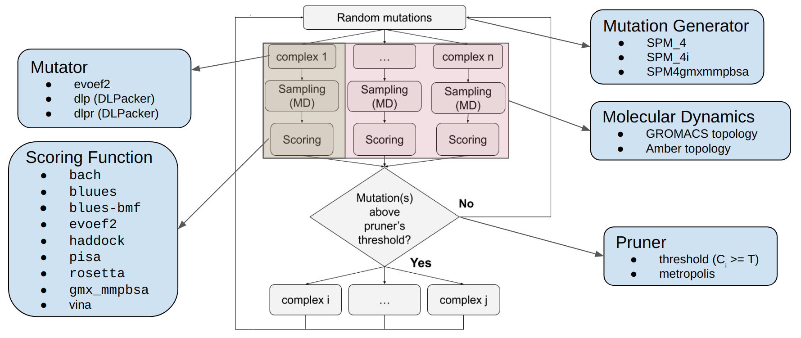

==========================================
Basic concepts
==========================================

Main idea
-------------

*locuaz* is a protocol for the *in silico* optimization of antibodies and nanobodies.
The procedure begins with a random mutation in the binder sequence. Subsequently,
the bound conformations are sampled through molecular dynamics simulations, and the target and binder interactions
are assessed using various scoring functions. Finally, a consensus criterion is applied to the binding scores
in order to accept or reject the mutation. This process is repeated iteratively to explore new sequences
with potentially improved affinities towards their targets. If the mutation does not significantly improve the affinity,
then the mutants are discarded and a new set of mutants are generated, based on the original complex(es).
This workflow is outlined in Figure 1.

.. figure:: ./resources/protocol_workflow_simple.png
        :alt: workflow

        Figure 1: The protocol's workflow.

Each new set of mutants (or complexes) generated will be referred to as an **epoch**, while each complex is referred to
as an **iteration**. 

.. note::

    Throughout this document, we will refer to the user configuration options as ``config``, and its various options as
    ``config["main"]["name"]``, ``config["scoring"]["functions"]``, etc...

Units
--------

*locuaz* has to coordinate between several external programs and be flexible enough to allow different
protocols to be run, hence, some abstractions are needed. We will call these abstractions *units*.

.. important::

    Since there are many tools and each of them has a different naming syntax, things can get confusing at times.
    This is why *locuaz* puts a layer of abstraction over them and standardizes their names. All external programs
    and any files they depend on (like their binaries), are named in lowercase letters without any other symbols.
    So, for example, while *gmx-mmpbsa* may be named at times *gmx_mmpbsa*,  *gmx-MMPBSA*, etc., we will always refer
    to it as :ref:`gmxmmpbsa` and its input script has to be named **gmxmmpbsa** and be located inside a folder called
    **gmxmmpbsa**.

    Other programs like the :ref:`rosetta` scoring function may need additional files. These are listed on its
    dedicated section.

Mutation Generator
------------------------
These units are the one in charge of generating the new binders. These are the currently available generators:

SPM4
"""""
This is a Single Point Mutation generator. This means that it chooses a single position (from the user input
``config["binder"]["mutating_resSeq"]``), and all the mutations will be performed there.
To choose which amino acid will be used, it splits all amino acids (except cysteine, which is discarded) in the
following categories: **negative**, **positive**, **hydrophobic** and **ring-containing**.
Then, it chooses 1 from each group to generate as many mutations as the user asked for
(``config["protocol"]["branches"]`` option).

Set ``config["generation"]["generator"]`` to ``SPM4`` use this generator.

SPM4i
""""""
Same as ``SPM4``, but not any position in ``config["binder"]["mutating_resSeq"]`` may be mutated. Those that are not
part of the current interface will be discarded. To determine the interface, *locuaz* uses the **freesasa** library which
uses a rolling-probe, whose radius can be set using the ``config["generation"]["probe_radius"]`` to any value ranging
from ``0.1`` to ``4.0`` (in angstrom units). The bigger the radius, the more residues will be classified as part of
the interface; the default is ``1.4``.

Set ``config["generation"]["generator"]`` to ``SPM4i`` use this generator.

SPM4gmxmmpbsa
------------------------
Same as ``SPM4i``, but besides **freesasa**, it's based on the use as **gmxmmpbsa** scoring function. The generator
will read the **decomp_gmxmmpbsa.csv** output file from **gmxmmpbsa** and pick the residue that is collaborating the
list with the interaction with the target. Obviously, this position has to also comply with the previous prerequisites,
that is, being part of the interface and one of the positions included in  ``config["binder"]["mutating_resSeq"]``.
You can also set the probe radius in this mutator.

Don't forget to include ``gmxmmpbsa`` alongside your other scoring functions (in ``config["scoring"]["functions"]``),
and to include instructions in the **gmxmmpbsa** input file to perform the decompositions. The decomposition section
should look something like this:

.. code-block:: console

    /
    &decomp
    idecomp=2, dec_verbose=0,
    print_res="within 4"
    /

Check Amber's manual and `gmx-mmpbsa <https://valdes-tresanco-ms.github.io/gmx_MMPBSA/dev/input_file/>`_ docs for more info.

Set ``config["generation"]["generator"]`` to ``SPM4gmxmmpbsa`` use this generator.

Mutator
--------
The mutators are the external tools that actually take the complex and perform the mutations generated by the mutation
generator, repack its side-chain and may repack the side-chains of neighboring residues as well.
There's no definitive best tool, so it's up to the user to choose one. These are the currently available
tools. The ones dependent on *DLPacker* are the only ones that are built into the protocol and can be readily used.
Check :ref:`Mutator` for a reference to the class that abstract over these programs.

Whichever one you choose, set the ``config["paths"]["mutator"]`` to the directory where it'll find the necessary files.

evoef2 mutator
""""""""""""""
``evoef2`` is one of the available scoring functions but, at heart, it's a Potential Energy Function (PEF) and it can
also replace a residue for another one, and then reorient it by minimizing its PEF. To use it, clone the `evoef2 repo`_,
rename it to ``evoef2`` compile it using the ``build.sh`` script and rename the binary to ``evoef2``.

Set ``config["mutation"]["mutator"]`` to ``evoef2`` use this mutator.

dlp mutator
"""""""""""
This mutator is based on *DLPacker* which is, according to our experiments, one of the best side-chain packers to use
after a mutation. It's the default mutator and while it comes built-in with *locuaz*, some of its data files are too
heavy to distribute along the source code.

In a ``dlpacker`` directory, the following files have to be present:

1. ``charges.rtp``
2. ``library.npz``
3. ``DLPacker_weights.h5``

The first 2 come with *locuaz*, but the `dlpacker weigthts`_ file has to be downloaded from a google drive.
Remember to make sure to tell *locuaz* where this directory is located, by setting the ``config["paths"]["mutator"]``
option.

Check the `dlpacker repo`_ for more info.
Set ``config["mutation"]["mutator"]`` to ``dlp`` use this mutator.

dlpr mutator
"""""""""""""""

Set ``config["mutation"]["mutator"]`` to ``dlpr`` use this mutator.

Molecular Dynamics
------------------------
as

GROMACS topology
"""""""""""""""""
s
Amber topology
""""""""""""""""
s

Scoring Function
-----------------
These are abstractions over external programs that allow the protocol to determine if the mutation was successful or
not. *gmxmmpbsa* is the only one that comes built-in with *locuaz* and does not an external binary, but it does need
an input script. More info on this and the rest on :ref:`Scoring Functions`.

Pruner
----------
as

top
"""""""
s
adaptive
"""""""""
s

threshold
"""""""""""
s

Summary
--------

The

        Figure 2: the protocol's main concepts and the stages at which they act. An **iteration** is highlighted in green
        and the **epoch** in pink.

dfd-

.. _evoef2 repo: https://github.com/xiaoqiah/EvoEF2
.. _dlpacker repo: https://github.com/nekitmm/DLPacker
.. _dlpacker weigthts: https://drive.google.com/file/d/1J4fV9aAr2nssrWN8mQ7Ui-9PVQseE0LQ