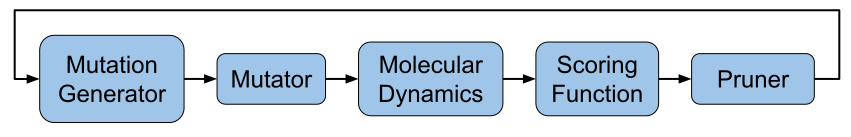

==================
Blocks
==================

Introduction
--------------

*locuaz* has several moving parts and each of them has its role in the optimization process.
The optimization procedure begins with the *Mutation Generator* generating a new random mutation
for the binder sequence, which is carried out by a *Mutator*, thus generating a new set of complexes between the binder and the target.
Subsequently, each complex is minimized, equilibrated with a NVT run and then sampled through a
NPT *Molecular Dynamics* simulation, so the target and binder interactions can be assessed with the chosen
*Scoring Function*(s). Finally, the *Pruner* applies a selection criterion using the binding scores in order to
accept or reject the mutation.

The process is repeated iteratively to explore new sequences with potentially improved affinities
towards their targets. This workflow is outlined in Figure 1.

        Figure 1: The protocol's workflow with respect to its **blocks**.

Many complexes can be generated on each run of this workflow and each of them will have MD data, scores, etc..
We will refer to each complex, plus its data as **branch**, while the set of **branches** from the same
run of this workflow is called an **epoch**.

We will now make a review of each of the **blocks** depicted in Figure 1.

.. note::

    Throughout this documentation, we will refer to the user configuration options as ``config``, and its
    various options as ``config["main"]["name"]``, ``config["scoring"]["functions"]``, etc...

*locuaz* has to coordinate between several external programs and be flexible enough to allow different
protocols to be run, hence, some abstractions are needed. We will call these abstractions *blocks*.

.. important::

    Since there are many tools and each of them has a different naming syntax, things can get confusing at times.
    This is why *locuaz* puts a layer of abstraction over them and standardizes their names. All external programs
    and any files they depend on (like their binaries), are named in lowercase letters without any other symbols.
    So, for example, while *gmx-mmpbsa* may be named at times *gmx_mmpbsa*,  *gmx-MMPBSA*, etc., we will always refer
    to it as :ref:`scoringfunctions:gmxmmpbsa` and its input script has to be named **gmxmmpbsa** and be
    located inside a folder called **gmxmmpbsa**.

    Other programs like the :ref:`scoringfunctions:rosetta` scoring function may need additional files.
    These are listed on its dedicated section.

Mutation Generator
------------------------
These blocks are the one in charge of generating the new binders. These are the currently available generators:

SPM4
"""""
This is a Single Point Mutation generator. This means that it chooses a single position (from the user input
``config["binder"]["mutating_resSeq"]``), and all the mutations will be performed there.
To choose which amino acid will be used, it splits all amino acids (except cysteine, which is discarded) in the
following categories: **negative**, **positive**, **hydrophobic** and **ring-containing**.
Then, it chooses 1 from each group to generate as many mutations as the user asked for
(``config["protocol"]["branches"]`` option).

Set ``config["generation"]["generator"]`` to ``SPM4`` use this generator.

SPM4i
""""""
SPM4i is similar to ``SPM4``, but it adds an additional filter before choosing which position to mutate.

Given the positions selected by the user on ``config["binder"]["mutating_resSeq"]``, ``SPM4i`` will
discard those that are not part of the target/binder interface.
To determine the interface, *locuaz* uses the **freesasa** library which uses a rolling-probe,
whose radius can be set using the ``config["generation"]["probe_radius"]`` to any value ranging
from ``0.1`` to ``4.0`` (in angstrom blocks). The bigger the radius, the more residues will be classified
as part of the interface; the default is ``1.4``.

Set ``config["generation"]["generator"]`` to ``SPM4i`` to use this generator.

SPM4gmxmmpbsa
""""""""""""""
Similar to ``SPM4i``, but besides **freesasa**, it's based on free energy considerations.
The generator will read the **decomp_gmxmmpbsa.csv** output file from **gmxmmpbsa** and pick the
residue that is collaborating the least with the interaction with the target.
At the same time, this position has to also comply with the previous prerequisites,
that is, being part of the interface and one of the positions included in  ``config["binder"]["mutating_resSeq"]``.
You can also set the probe radius in this mutator.

.. important::

    Don't forget to include ``gmxmmpbsa`` alongside your other scoring functions (in ``config["scoring"]["functions"]``),
    and to include instructions in the **gmxmmpbsa** input file to perform the decompositions. The decomposition section
    should look something like this:

    .. code-block:: console

        /
        &decomp
        idecomp=2, dec_verbose=0,
        print_res="within 4"
        /

Check Amber's manual and `gmx_MMPBSA`_ docs for more info.

Set ``config["generation"]["generator"]`` to ``SPM4gmxmmpbsa`` use this generator.

Mutator
--------
The mutators are the external tools that actually take the complex and perform the mutations generated by the mutation
generator, repack its side-chain and may repack the side-chains of neighboring residues as well.
There's no definitive best tool, so it's up to the user to choose one after appropriate benchmarks are done.

*Mutators* based on *DLPacker* are the only ones that are built into the protocol and can be readily used, once
its weights are downloaded. Other *Mutators* like the one based on *EvoEF2* need an external binary that has
to be downloaded. More tools can easily be added, through the interface that the *Mutator* class offers.
Check :ref:`mutators:Mutators` for a reference to the class that abstract over these programs.

Whichever one you choose, set the ``config["paths"]["mutator"]`` to the directory where it'll find the necessary files.

dlp mutator
""""""""""""
This mutator is based on *DLPacker* which is, according to our benchmarks, one of the best side-chain packers to use
after a mutation. It's the default mutator and while it comes built-in with *locuaz*, it needs its weights, which
are too heavy to be bundled alongside the installation. Check :ref:`mutators:Mutators` for more info about this.
Set ``config["mutation"]["mutator"]`` to ``dlp`` use this mutator.

dlpr mutator
""""""""""""""

Set ``config["mutation"]["mutator"]`` to ``dlpr`` use this mutator and adjust the reconstruct radius with the
``config['mutation']['reconstruct_radius']`` option.
Check :ref:`installation:Post-installation` or :ref:`mutators:Mutators` for more info about this.

evoef2 mutator
""""""""""""""
``evoef2`` is one of the available scoring functions but, at heart, it's a Potential Energy Function (PEF) and it can
also replace a residue for another one, and then reorient it by minimizing its PEF. To use it, clone the `evoef2 repo`_,
rename it to ``evoef2`` compile it using the ``build.sh`` script and rename the binary to ``evoef2``.

Set ``config["mutation"]["mutator"]`` to ``evoef2`` use this mutator.

Molecular Dynamics (MD)
------------------------
MD of the complexes is carried out using the `GROMACS`_ simulation package, so some of the options associated
to this block are transparent wrappers to GROMACS command line options, like ``config['md']['mpi_procs']``,
``config['md']['omp_procs']`` and ``config['md']['pinoffsets']``, which map to ``-ntmpi``, ``-ntomp`` and
``-pinoffset``. Other GROMACS options are hard-coded, like ``-pin on`` and the use of the GPU for all interactions
but the bonded ones.

Naturally, the *mdp* inputs also need to be specified in ``config['md']['mdp_names']['min_mdp']``,
``config['md']['mdp_names']['nvt_mdp']`` and ``config['md']['mdp_names']['npt_mdp']``, which correspond to
the minimization, NVT and NPT, respectively.

Another important one is ``config['md']['ngpus']``, which will determine the number of parallel runs that can be ran.
With respect to topologies, these can be built and updated iteravely either with GROMACS or `Amber`_'s Tleap.

Lastly ``config['md']['gmx_mdrun']`` allows setting the name of the binary that carries out the MD. Its default
value is usually the right one (``gmx mdrun``), but users of some systems may realize that the sysadmins have
compiled the *mdrun* command with a different name; this is why we added this option.

GROMACS topology
"""""""""""""""""
When using GROMACS to build the topology, ``config['md']['water_type']`` and ``config['md']['force_field']``
can be configured. Noticed there are no options to set the box. locuaz does not run any ``editconf`` commands, it
will always keep the box from the system.

Amber topology
""""""""""""""""
While the engine is always GROMACS, the topology can be built through Amber as well by setting
``config['md']['use_tleap']`` to ``True``. ``config['paths']['tleap']`` also needs to be set alongside,
so *locuaz* can copy the path with all the necessary files to rebuild the topology after each mutation.

Scoring Function
-----------------
These are abstractions over external programs that estimate the affinity between the target and the binder over
each frame of the MD. *gmxmmpbsa* is the only one that comes built-in with *locuaz* and does not
an external binary, but it does need an input script.
More info on all scoring functions can be found at :ref:`scoringfunctions:Scoring Functions`.

Pruner
----------
After scoring the affinity, the chosen *Pruner* will decide if the mutation was successful or not.
*Pruners* will take the original complex(es) and the newly mutated ones and will output the best of them
for the next round of optimization.
The exact criteria that will decide which complex(es) are at the top depends on the chosen *pruner*.
More info on this at :ref:`pruners:Pruners`.

metropolis
"""""""""""
When using just one scoring function, the *metropolis* *pruner* can be used which, as its name suggests,
uses the metropolis acceptance ratio to decide if the mutation is accepted or not.

consensus
"""""""""""
If many scoring functions are used, the *consensus* *pruner* checks how many of them improved their scores
on the mutated complex with respect to the previous one, if enough of them indicate an in increase in affinity,
then the new complex is accepted. Check :ref:`pruners:locuaz.prunerconsensus module` for more info and
this `reference`_ for more details.

Summary
--------

All these blocks can be configured, giving rise to many different protocols.
Refer to the Figure 2 for a graphical abstract of them and check the tutorials for some concrete examples.

.. figure:: ./resources/protocol_workflow.png
        :alt: enhanced workflow

        Figure 2: the protocol's main concepts and the stages at which they act. An **branch** is highlighted in green
        and the **epoch** in pink.

.. _evoef2 repo: https://github.com/xiaoqiah/EvoEF2
.. _dlpacker repo: https://github.com/nekitmm/DLPacker
.. _here: https://istitutoitalianotecnologia-my.sharepoint.com/:u:/g/personal/walter_rocchia_iit_it/Efzdf2sgKwJNmJskcHDE7yUBQMVgFsbpACeQLDGRYKvQOA?e=2E0daX
.. _GROMACS: https://manual.gromacs.org/current/index.html
.. _Amber: https://ambermd.org/Manuals.php
.. _gmx_MMPBSA: https://valdes-tresanco-ms.github.io/gmx_MMPBSA/dev/input_file/
.. _reference: https://pubs.rsc.org/en/content/articlelanding/2019/cc/c9cc06182g
