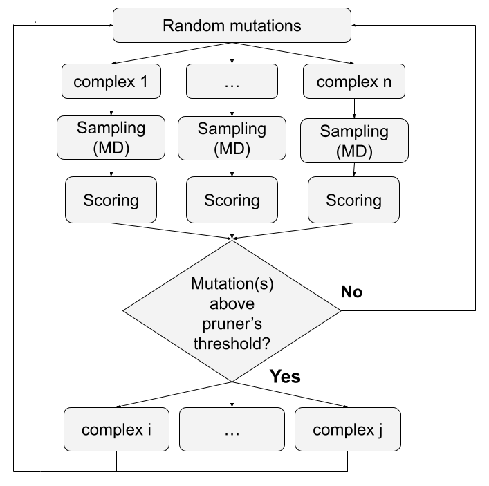

LOCUAZ optimization protocol
======================================

.. image:: https://img.shields.io/pypi/v/locuaz.svg
        :target: https://pypi.python.org/pypi/locuaz

.. image:: https://readthedocs.org/projects/locuaz/badge/?version=latest
        :target: https://locuaz.readthedocs.io/en/latest/?version=latest
        :alt: Documentation Status

.. image:: https://img.shields.io/badge/cite-locuaz-red
        :target: citing.html
        :alt: Cite LOCUAZ

.. image:: https://img.shields.io/badge/license-MIT-yellow
        :target: citing.html
        :alt: License

*locuaz* is a high-performance software platform designed specifically for *in-silico* optimization of
antibodies, antibody fragments like nanobodies, or any peptide binder towards other proteins and
small ligands.

Rather than being a single protocol, *locuaz* provides a platform upon which multiple optimization protocols
can be implemented, thus offering versatility and adaptability to diverse scientific needs.

*locuaz* initiates the optimization process by generating a variety of target-binder complexes through
random mutations in the binder sequence. Following this, the complexes undergo parallel minimization and
equilibration before a NPT Molecular Dynamics (MD) simulation is run.
Target-binder interactions on each frame are then simultaneously assessed by a set of scorers,
utilizing available processors to then estimate if the mutations improved affinity. If so,
the procedure is repeated with the new complexes, continuing the exploration of new binders.
This workflow is outlined in Figure 1.

With its tailored design for HPC environments and a flexible approach to various protocols, *locuaz*
delivers efficient *in-silico* optimization.

        Figure 1: The protocol's workflow.

.. toctree::
    :maxdepth: 2
    :caption: Installation

    installation

.. toctree::
    :maxdepth: 2
    :caption: Learning

    platformflow
    blocks
    tutorialsimple
    tutorialtleap
    tutorialligand
    jobsubmission
    faq

.. toctree::
    :maxdepth: 1
    :caption: Reference

    mutationgenerators
    mutationcreator
    scorers
    mutators
    statistics
    pruners
    misc
    configurationfile
    citing
    history
    developing

Indices and tables
==================
* :ref:`genindex`
* :ref:`modindex`
* :ref:`search`
