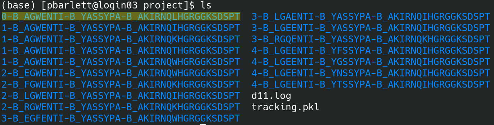
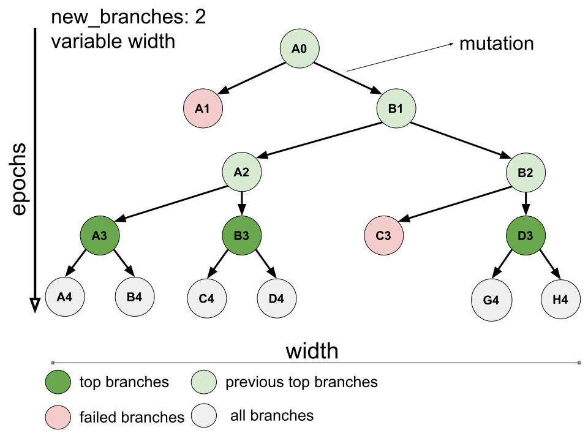
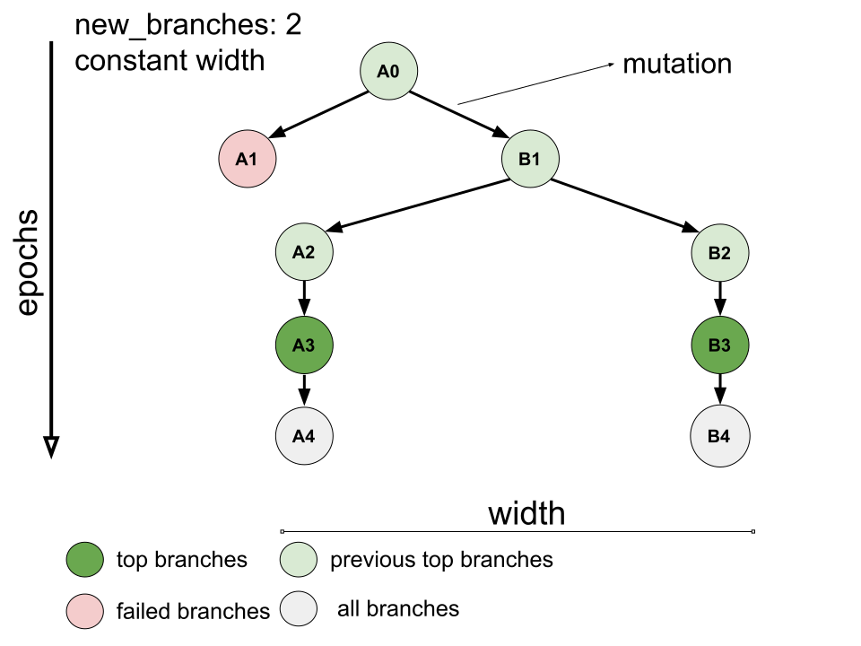

==================
Platform flow
==================

Introduction
---------------

*locuaz* takes one or more docked target-binder complexes and performs mutations on user selected binder sequences.
These subsequent mutations are performed simultaneously to evaluate the vicinity of the solution landscape,
and sequentially to advance in the optimization process. Simultaneous mutations give rise to **iterations**,
which all together compose an **epoch**.

The initial complex(es) are used to create the initial *iterations*, which belong to the *epoch 0*.
A full *iteration* includes:

 * Complex files: the complex structure (**.pdb** and **.gro**), index file (**.ndx**) and a
   topology (in a **.zip** file).
 * Minimization files: all files generated from the minimization run, prefixed by **min_**
 * NVT files: all files generated from the NVT run, prefixed by **nvt_**
 * NPT files: all files generated from the NPT run, prefixed by **npt_**
 * A **scoring** folder with the affinity scores for each frame, from each scoring function.
 * Other miscellaneous files: leftover files from the mutation process *Tleap* script, if used, etc...

A *locuaz* project is made of these iterations, as can be seen on Figure 1.

        Figure 1: project directory for the optimization of an antibody's 3 CDRs.
        Each folder corresponds to an **iteration**. The one from **epoch 0** is highlighted.
        *iterations* are identified by the residues that are being optimized and the chainID they correspond to.
        *iterations* names are prepended by the *epoch* they belong to. So, the initial complex begins with
        **0-** and then 3 sequences (all belonging to chainID **B**) are identified by their 1-letter coded
        amino acids, these are the CDRs

While Figure 1 shows how the a *locuaz* project is actually laid out, we don't think about *epochs*
and *iterations* as a plain list, but as nodes of a tree or, more correctly, a Directed Acyclic Graph (DAG).

Platform DAGs
---------------

Variable width DAG
^^^^^^^^^^^^^^^^^^^
Figure 2 shows how we think of a usual *locuaz* run. From a docked complex *locuaz* creates
our first *iteration* which we'll name **A0**, given that's the first *iteration* from *epoch* 0.
Then, the binder is mutated and, in this particular case, the user asked for 2 new *branches* to be
generated. The edge that joins the *iterations* (nodes) represent this step.

Now, after scoring the *iterations* **A1** and **B1**, the protocol finds that **A1**'s mutation wasn't
beneficial and hence discards it to continue the protocol from **B1**, the **top iteration** from *epoch* 1.
The process continues and we see that on *epoch* 2 both mutants had improved affinity and now 4 parallel
*iterations* were evaluated on *epoch* 3, of which 1 failed to improve affinity (**C3**), leaving 3
*iterations* to be twicely mutated to generate *epoch* 4 with 6 *iterations*.
These are shown in gray given that are not yet finished.

        Figure 2: DAG of a hypothetical run. The current epoch is the fourth one. The current
        **top iterations** are highlighted in green and gave origin to the current **all iterations**
        which are being still run. Previous **top iterations** are in pale green while the
        iterations that failed to improve the affinity are noted as **failed iterations** (pale pink).

Constant width DAG
^^^^^^^^^^^^^^^^^^^^
Finally, we can see how the DAG would look like if the user selects a constant width run.
This prevent the number of simultaneous *iterations* from exploding, but it does limit the number of
potential solutions that are explored.

        Figure 3: same system as the one from Figure 1, but this time the user selected a constant
        width, so the number of branches is the number of *iterations* that are run at each *epoch*.

Summary
--------
*locuaz* works by extending this DAG. Its shape will be decided by the user configuration and the
results of the optimization process. And while we skipped over several important details during
the previous explanation, on the next section we'll take a look at each functional block that
takes care of each step such as mutation, molecular dynamics, scoring, etc...
