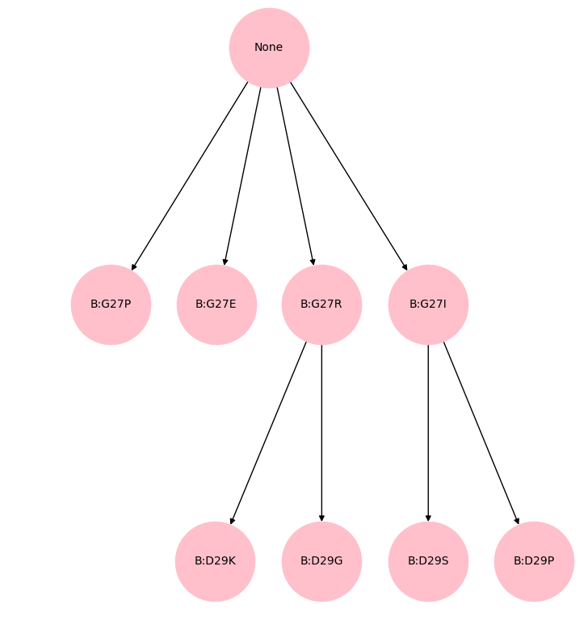

Pruners
====================
This block is in charge of deciding which *Iterations* go through the next epoch, according to their scores.

locuaz.prunerconsensus module
------------------------------
Under this *pruner*, for a new complex to pass onto the next *epoch*, it has to beat all previous complexes
that gave rise to it.
Using this pruner, a new complex beats a previous one when the means of its scores are lower than those
from the previous complex, given that a lower score number indicates higher affinity between the
target and the binder.

Now, since scoring functions tend to diverge, it's not necessary for all of them to improve.
The user can set a minimum threshold of scoring functions that have to improve so a binder can
be considered better than another.

For example, if a user is using **4** scoring functions, the user can set the ``threshold``
to, say, **2** and if 2 scoring functions indicate an improvement, then the new complex
beats the old one. More formally:

.. math::

   c_{k}^{i} = \left\{
    \begin{array}{l}
    1, \quad \text{if} \ avg\left(score^{i+1}_{k}\right) < avg\left(score^{i}_{k}\right) \\
    0, \quad \text{else}
    \end{array}
    \right.

Where
:math:`c_{k}^{i}` counts how many scoring functions improved with respect to the previous complex,
while :math:`k` and :math:`i` are the indices for scoring functions and complexes, respectively.

Then, a consensus number :math:`C^{i}` is obtained by adding all the :math:`c_{k}^{i}` for the
:math:`N` scoring functions, and this number is compared against the threshold :math:`T`:

.. math::

    C^{i} = \sum_{k=1}^{N} c_{k}^{i}
    
.. math::
    C^{i} \geq T ?

If the last statement is true, then complex :math:`i+1` beats :math:`i` and can be considered
for a next round of mutations.

consensus run example
^^^^^^^^^^^^^^^^^^^^^^^
In this example the user started with 1 complex and the options ``pruner: consensus``, ``consensus_threshold: 3``,
``branches: 4`` and ``width: True``, among others. Figure 1 shows a Directed Acyclic Graph (DAG) of the current progress
for the optimization. It shows 3 epochs (the height of the DAG) and each node corresponds to a different *iteration*.
Each *iteration* is connected with the one that preceded it and labeled with the performed mutation.

        Figure 1: 3 **epochs** of a protocol using the *consensus* pruner.

On epoch 2, the protocol randomly chooses position 27 on the chain **B** to mutate and given that the user
asked for 4 branches, 4 new complexes are generated. Then, after running and scoring the 4 new complexes
the *consensus pruner* gets as input a set of 5 *iterations*: **None** (the original complex),
**B:G27P**, **B:G27E**, **B:G27R** and **B:G27I** (the recently generated complexes).
It then compares the means of the scoring functions of each of the 4 generated complexes against the original
complex and determines the following:

 * For **B:G27P**: only 1 scoring function improved with respect to the original.
 * For **B:G27E**: 2 scoring functions improved with respect to the original.
 * For **B:G27R**: 4 scoring functions improved with respect to the original.
 * For **B:G27I**: 3 scoring functions improved with respect to the original.

Since ``consensus_threshold`` was set to 3, only **B:G27R** and **B:G27I** are kept and mutated again on the
next **epoch**. And since the user set ``branches`` to 4 and a constant width, these **iterations** will be
mutated twice each, for the generation of the next **epoch**.

Finally, on **epoch** 3, after the MD and the scoring of the generated complexes is done, the *pruner* will get
6 **iterations**: **B:D29K**, **B:D29G**, **B:G29R**, **B:D29S** and the previous ones: **B:G27R** and **B:G27I**.
For the new **iterations** to pass, they will have to beat both **B:G27R** and **B:G27I** and that means, again,
improving the average score on, at least, 3 scoring functions.

.. automodule:: locuaz.prunerconsensus
   :members:
   :undoc-members:
   :show-inheritance:

locuaz.prunermetropolis module
--------------------------------
When using only 1 scoring function, the well known *metropolis acceptance criteria* can be used to decide
whether a complex passes to the next *epoch*:

.. math::

    \text{Acceptance ratio} = \min\left(1, \exp\left(-\frac{\Delta E}{k_B T}\right)\right)

Then a random number between :math:`0` and :math:`1` is generated and if the *Acceptance ratio* is above it,
then the new complex is considered to beat the old one.

.. automodule:: locuaz.prunermetropolis
   :members:
   :undoc-members:
   :show-inheritance:

locuaz.pruners module
---------------------

.. automodule:: locuaz.pruners
   :members:
   :undoc-members:
   :show-inheritance:

locuaz.abstractpruner module
-----------------------------

.. automodule:: locuaz.abstractpruner
   :members:
   :undoc-members:
   :show-inheritance:
