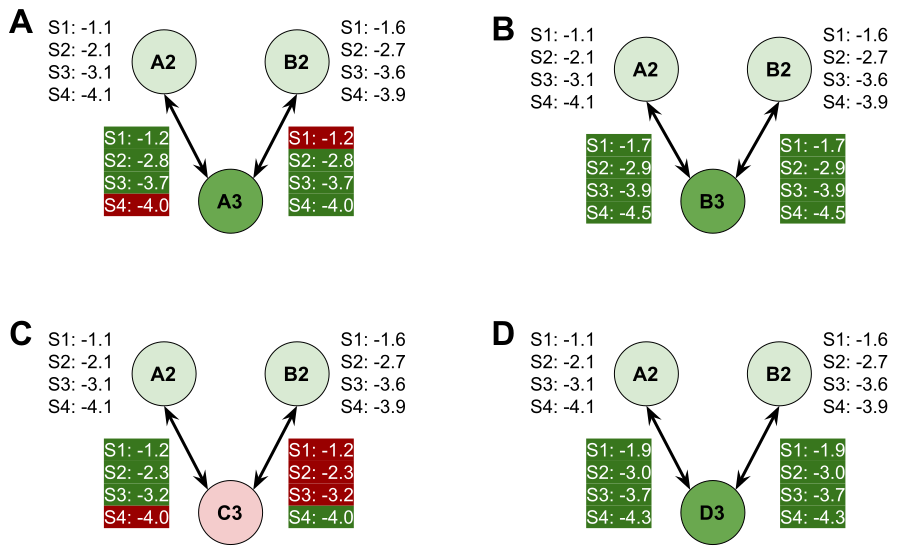

Pruners
====================
This block is in charge of deciding which *branches* from the last 2 **epochs** go through
onto the next **epoch**, according to their scores. It takes the top *branches* from the previous
**epoch** and the current branches from the current **epoch** and decides which are the top *branches*
of the current **epoch**.

.. figure:: ./resources/pruner.png
        :alt: pruner
        :scale: 100%

        Figure 1: inputs and outputs of a *pruner* at *epoch* **i**. The exact process by which the
        *pruner* compares *branches* to decide which ones improve the affinity and should be used
        as a substrate for the next mutations depended on the chosen *pruner*.

.. warning::
    For the purposes of these docs, we'll be using **complex** and **branch** as synonyms, though technically,
    a *branch* is comprised of a complex and other information, like its trajectory, its scores, etc...

locuaz.prunerconsensus module
------------------------------
Under this *pruner*, for a new complex to pass onto the next *epoch*, it has to beat all previous complexes
that gave rise to it.
Using this pruner, a new complex beats a previous one when the means of its scores are lower than those
from the previous complex, given that a lower score number indicates higher affinity between the
target and the binder.

Now, since scoring functions tend to diverge, it's not necessary for all of them to improve.
The user can set a minimum threshold of scoring functions that have to improve so a binder can
be considered better than another.

For example, if a user is using **4** scoring functions, the user can set the ``threshold``
to, say, **2** and if 2 scoring functions indicate an improvement, then the new complex
beats the old one. More formally:

.. math::

   c_{k}^{i} = \left\{
    \begin{array}{l}
    1, \quad \text{if} \ avg\left(score^{i+1}_{k}\right) < avg\left(score^{i}_{k}\right) \\
    0, \quad \text{else}
    \end{array}
    \right.

Where
:math:`c_{k}^{i}` counts how many scoring functions improved with respect to the previous complex,
while :math:`k` and :math:`i` are the indices for scoring functions and complexes, respectively.

Then, a consensus number :math:`C^{i}` is obtained by adding all the :math:`c_{k}^{i}` for the
:math:`N` scoring functions, and this number is compared against the threshold :math:`T`:

.. math::

    C^{i} = \sum_{k=1}^{N} c_{k}^{i}
    
.. math::
    C^{i} \geq T ?

If the last statement is true, then complex :math:`i+1` beats :math:`i` and can be considered
for a next round of mutations.

consensus run example
^^^^^^^^^^^^^^^^^^^^^^^
Recapping the hypothetical example from :ref:`platformflow:Platform DAGs`, we are going to focus on *epoch*
3 to see how the pruner decides that *branches* **A3**, **B3** and **C3** should go through, but not **D3**.

In this example the user selected the options ``pruner: consensus``, ``consensus_threshold: 3``,
``branches: 2`` and ``constant_width: False``, among others. Check the tutorials and the
:ref:`configurationfile:YAML configuration file` if you need a refresh on these options.
Figure 2 focuses on this step.

        Figure 2: at *epoch* 3, *epoch* 2 and 3 are considered. Since we're going back to *epoch* 3,
        **A3**, **B3**, **C3** and **D3** show up in gray, as the *pruner* hasn't decided yet which ones
        improve on the affinity and which ones don't. Average scores according to each of the scoring
        functions (**S1**, **S2**, **S3** and **S4**) show up on the side.

After the MD is ran and the scoring is done, it's time for the *pruner*.
The *consensus pruner* does the following: for each *branch* on the current *epoch* being pruned,
its average scores are compared against the scores of all the *top branches* from the previous *epoch*.
For example, Figure 3A shows the comparison of **A3** *branch* against the 2 previous *top branches*.
Since on both cases it beats the previous *top branch* in 3 out of 4 scoring functions, **A3** *branch*
will be the first *top branch* of *epoch* 3. On the other hand, we can see that **C3** only improves on 1
scoring function with respect to the previous *top branch* **B2** and, hence, it can't move forward
since the user selected a ``consensus_threshold`` fo 3.

        Figure 3: each panel shows the comparisons between each of the *epoch* 3 *branches* and the
        *epoch* 2 *top branches*. Average scores highlighted in green are the ones that are better
        than their respective counterparts, while the red ones are worse. *Branch* **C3** "looses"
        when compared against **B2** and hence won't be moving forward.

.. automodule:: locuaz.prunerconsensus
   :members:
   :undoc-members:
   :show-inheritance:

locuaz.prunermetropolis module
--------------------------------
When using only 1 scoring function, the well known *metropolis acceptance criteria* can be used to decide
whether a complex passes to the next *epoch*:

.. math::

    \text{Acceptance ratio} = \min\left(1, \exp\left(-\frac{\Delta E}{k_B T}\right)\right)

Then a random number between :math:`0` and :math:`1` is generated and if the *Acceptance ratio* is above it,
then the new complex is considered to beat the old one.

.. automodule:: locuaz.prunermetropolis
   :members:
   :undoc-members:
   :show-inheritance:

locuaz.pruners module
---------------------

.. automodule:: locuaz.pruners
   :members:
   :undoc-members:
   :show-inheritance:

locuaz.abstractpruner module
-----------------------------

.. automodule:: locuaz.abstractpruner
   :members:
   :undoc-members:
   :show-inheritance:
