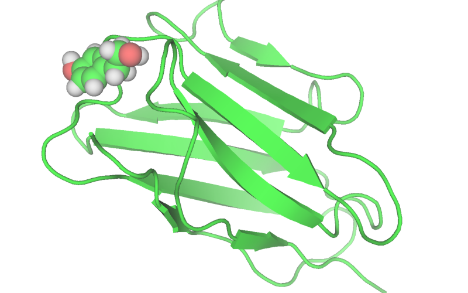
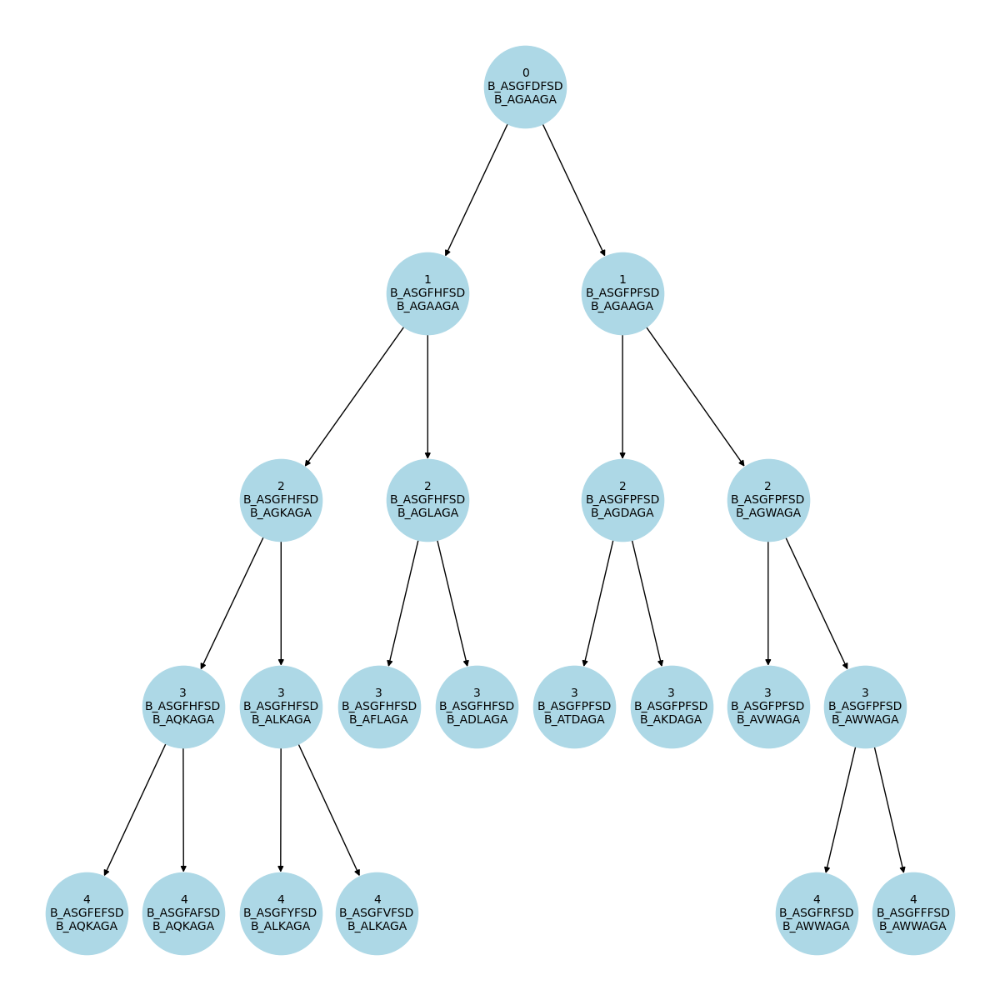

===================================================
Tutorial: optimizing an antibody against a ligand
===================================================

Sometimes our starting docked structure is not very good, and the binder may loose
the target after some nanoseconds. This is more frequent when simulating docked
ligands. *locuaz* supports the addition of positional restraints so users can get
started with their optimizations, until a better binder is found.

In this tutorial we will use what we learnt in previous tutorials, plus some other
new tricks, to optimize a nanobody against a tirosol molecule, like the one on
Figure 1.

        Figure 1: our starting complex, a tirosol molecule docked to a nanobody.

As usual, activate your locuaz environment and get the `necessary files`_.

.. _necessary files: https://github.com/pgbarletta/locuaz/tree/main/examples/ligand_tutorial

Necessary files
----------------
As always we're going to need a starting PDB and as in
:ref:`tutorialtleap:Tutorial: using Tleap topologies`, we'll also need
a set of tleap related files in order to rebuild the topology of our system after
each mutation.

1. ``tir.pdb``: the PDB file of the pre-equilibrated complex. As usual, target chains go first, also,
   remember that since we are using *Tleap*, residues should be numbered on a continuous progression.
2. ``tleap``: *Tleap* dir with the script to build the topology of the system each time a mutation is performed.
   Remember to avoid solvating and creating a box in this file, since the solvent
   will already be present. Another thing to notice is the usage of ``addions``.
   We keep this commands since *Tleap* will be responsible of keeping neutrality
   of the system. Avoid using ``addions2`` since we need it to replace water molecules
   each time it ads ions, to keep the *N* of the system constant.
   You'll also find ``lig.frcmod`` and ``lig.prep``, the auxiliary tirosol parameters.
3. ``config_ligand.yaml``: the input file to run the protocol.
4. ``mdp`` directory: minimization, NVT and NPT *GROMACS* input files.

If you are finding it hard to get a PDB of your system with chainID information,
check the :ref:`FAQ <faq1>`.

The configuration file
-----------------------
We will focus on the new options that didn't show up on the previous tutorials.

protocol
^^^^^^^^
.. code-block:: console

    paths:
        epochs: 10
        new_branches: 2
        constant_width: false
        memory_size: 4
        failed_memory_size: 6

* ``constant_width``: when this value is set to ``false``, ``new_branches`` means
  the number of branches (new mutations) that are obtained from **each** previous branch.
  Check :ref:`platformflow:Platform DAGs` for more info.

pruning
^^^^^^^^
.. code-block:: console

    pruning:
        pruner: metropolis
        kT: 0.593

* ``pruner: metropolis``: uses the Metropolis-Hastings criteria to decide if a
  new branch passes to the next epoch. Does not work with multiple scorers.
* ``kT``: product between the boltzmann constant and a temperature. The current
  value corresponds to a temperature of 300K.

md
^^
.. code-block:: console

    md:
        gmx_mdrun: "gmx mdrun"
        mdp_names:
            min_mdp: min.mdp
            nvt_mdp: short_nvt.mdp
            npt_mdp: short_npt_posres.mdp
        mps: true
        numa_regions: 1
        use_tleap: true
        maxwarn: 2
        box_type: octahedron
        npt_restraints:
            posres: 50
            posres_water: 50

* ``mps``: when set to ``true``, *locuaz* will use the NVIDIA Multi-Process Server (MPS),
  to run multiple MD simulations per GPU. This usually decreases the speed of each
  run, but considerably increases the total throughput. Useful when using a variable
  width DAG protocol which may make the number of branches explode.
  Check this `blog post`_ for more info.
* ``numa_regions``: when using MPS, *locuaz* will automatically set these options:
  ``ngpus``, ``mpi_procs``, ``omp_procs`` and ``pinoffsets``. To be able to do this
  effectively, it needs to know CPU affinity of each GPU, which should follow the
  NUMA layout.
  Check the :ref:`FAQ<faq3>` if you don't know how many regions you have.
* ``npt_restraints``: This is where we set the value for our positional restraints.
  Remember also to define the ``-DPOSRES`` and ``-DPOSRES_WATER`` flags in your
  NPT mdp file so these take effect.

.. _blog post: https://developer.nvidia.com/blog/maximizing-gromacs-throughput-with-multiple-simulations-per-gpu-using-mps-and-mig/

scoring
^^^^^^^
.. code-block:: console

    scoring:
        scorers: [autodockvina]
        allowed_nonstandard_residues: [UNL]
        nthreads: 6
        mpi_procs: 1

* ``allowed_nonstandard_residues``: when scoring, the NPT trajectory is split
  in "sanitized" PDB frames. That is, they receive a treatment to make sure the
  scorers don't error out when meeting unexpected artifacts, like non-standard
  residues. All scorers but gmxmmpbsa use this PDBs. Since we want to score the
  interaction between our nanobody and a tirosol molecule, we need to add it
  to this list of residue names, so *locuaz* doesn't remove it from the PDB frames.

Running the protocol
---------------------
Nothing new here, we just run the protocol with our config file::

    mamba activate locuaz
    python /home/user/locuaz/locuaz/protocol.py config_ligand.yaml

It's educational to look at the DAG with the branch names that *locuaz* draws.
See Figure 2

        Figure 2: Directed Acyclic Graph (DAG) of a sample optimization against
        the tirosol molecule. Notice that 2 branches are generated from each
        previous top branch which makes the number of branches increase up to 8
        before it gets lowered to 6 because only 3 of those 8 passed onto the
        next epoch.

