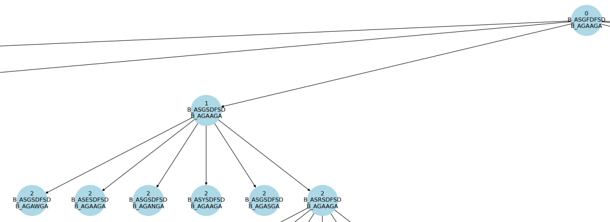

===================================================
Tutorial: optimizing an antibody against a ligand
===================================================

Sometimes our starting docked structure is not very good, and the binder may loose
the target after some nanoseconds. This is more frequent when simulating docked
ligands. *locuaz* supports the addition of positional restraints so users can get
started with their optimizations, until a better binder is found.

In this tutorial we will use what we learnt in previous tutorials, plus some other
new tricks, to optimize a nanobody against a tirosol molecule, like the one on
Figure 1.

        Figure 1: our starting complex, a tirosol molecule docked to a nanobody.

As usual, activate your locuaz environment and get the `necessary files`_

.. _necessary files: https://github.com/pgbarletta/locuaz/tree/main/examples/ligand_tutorial

Necessary files
----------------
As always we're going to need a starting PDB and as in
:ref:`tutorialtleap:Tutorial: running a simple optimization`, we'll also need
a set of tleap related files in order to rebuild the topology of our system after
each mutation.

1. ``tir.pdb``: the PDB file of the pre-equilibrated complex. As usual, target chains go first, also,
   remember that since we are using *Tleap* residues should be numbered on a continuous progression.
2. ``tleap``: *Tleap* dir with the script to build the topology of the system each time a mutation is performed.
   Remember to avoid solvating and creating a box in this file, since the solvent
   will already be present. Another thing to notice is the usage of ``addions``.
   We keep this commands since *Tleap* will be responsible of keeping neutrality
   of the system. Avoid using ``addions2`` since we need it to replace water molecules
   each time it ads ions, to keep the *N* of the system constant.
   You'll also find ``lig.frcmod`` and ``lig.prep``, the auxiliary tirosol parameters.
3. ``config_ligand.yaml``: the input file to run the protocol.
4. ``mdp`` directory: minimization, NVT and NPT *GROMACS* input files.

If you are finding it hard to get a PDB of your system with chainID information,
check the :ref:`FAQ <faq1>`.

The configuration file
-----------------------
We will focus on the new options that didn't show up on the previous tutorials.

protocol
^^^^^^^^
.. code-block:: console

    paths:
        epochs: 10
        new_branches: 2
        constant_width: false
        memory_size: 4
        failed_memory_size: 6

pruning
^^^^^^^^
.. code-block:: console

    pruning:
        pruner: metropolis
        kT: 0.593

md
^^
.. code-block:: console

    md:
        gmx_mdrun: "gmx mdrun"
        mdp_names:
            min_mdp: min.mdp
            nvt_mdp: short_nvt.mdp
            npt_mdp: short_npt_posres.mdp
        mps: true
        numa_regions: 1
        use_tleap: true
        maxwarn: 2
        box_type: octahedron
        npt_restraints:
            posres: 50
            posres_water: 50

s

scoring
^^^^^^^
.. code-block:: console

    scoring:
        scorers: [autodockvina]
        allowed_nonstandard_residues: [UNL]
        nthreads: 6
        mpi_procs: 1

``allowed_nonstandard_residues``

remember that for scoring, all target chains are renamed A, and all the ones from the binder are renamed B.
write about the sanitization the protocol does with the splitted frames. All scorers but gmxmmpbsa use this PDBs.

``memory_positions`` and ``failed_memory_positions``:
empty memory slots on input user memory are allowed.
This allows the user to control for how many epochs will the non-empty memory be recalled.
Place them after the desired positions:

``memory_positions: [[2, 3, 4, 6, 7, 8], [], [], [] ]``

        Figure 1: snapshot of one optimized complex. **p53** is the yellow one on the left, with its loops colored red and
        blue, these loops have to be stabilized so it doesn't loose its function; the zinc atom and its coordinating
