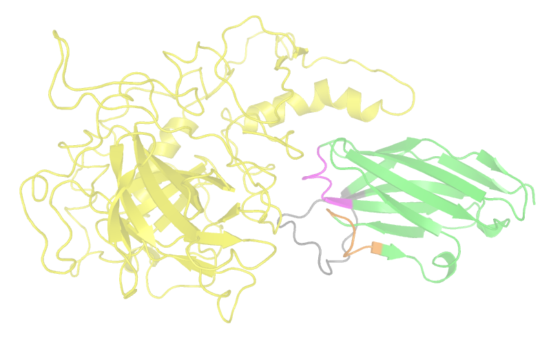

==========================================
Tutorial: running a simple optimization
==========================================

To recap, locuaz iteratively performs mutations on the selected residues of the binder, followed by minimization and
MD simulation. The trajectory is then scored with various scoring functions, to assess whether the mutation
results in higher or lower affinity. If the mutation results in better affinity, the mutation is accepted,
and the process is repeated. If the mutation does not significantly improve the affinity, then the mutants
are discarded and a new set of mutants are generated, based on the original complex(es).

In this tutorial, we are going to optimize the 3 CDRs from a nanobody against a p53 protein. This *p53* has a
*TWIST box* where the *TWIST* protein attaches and promotes its degradation. To prevent this, we're going to optimize
a nanobody that will compete for the binding of the *TWIST box*. For more info, check the `reference`_.

Assuming we have a conda environment named *locuaz*, let's start by activating it:

.. code-block:: console

    mamba activate locuaz

        Figure 1: snapshot of one optimized complex. **p53** is the yellow one on the left. Attached to its TWIST-box
        it's the nanobody, with a green backbone and with its CDRs 1, 2 and 3 colored magenta, orange and gray,
        respectively.

Setting up the system
----------------------
It is advisable to use a pre-equilibrated system as the starting complex for the optimization protocol.
In general, the following guidelines can be followed for the systems preparation:

1. The binder and target are docked with any docking program of choice.
2. The selected initial complex structures is then equilibrated in a box of water.
3. The PDB file of the equilibrated structure can then be used for the protocol.

Necessary files
----------------
This tutorial will provide a step-by-step guidance to the use of the locuaz protocol to optimize a nanobody
(VHH) as a p53 binder (figure shown above). The bulk of it will concentrate on the writing of the
configuration yaml file. A more detailed explanation of the available options, can be found in the
:ref:`configurationfile:YAML configuration file`. The materials for this tutorial are located in
the ``examples/simple_tutorial`` folder. You can dowload them from `this link`_

1. ``d11.pdb``: the PDB file of the pre-equilibrated complex. Target chains go first and then the binders.
2. ``config_simple.yaml``: the configuration file; all options go in here.
3. ``mdp`` directory: minimization, NVT and NPT *GROMACS* input files.
4. ``gmxmmpbsa``: the input file for the *gmxmmpbsa* scoring function

.. _reference: http://dx.doi.org/10.1016/j.ccr.2012.08.003
.. _this link: https://istitutoitalianotecnologia-my.sharepoint.com/personal/walter_rocchia_iit_it/_layouts/15/onedrive.aspx?ga=1&id=%2Fpersonal%2Fwalter%5Frocchia%5Fiit%5Fit%2FDocuments%2FExamples%2Fsimple%5Ftutorial&view=0

The configuration file
-----------------------
Options don't go all bunched up together, there are classified in sections. We will review each one of them.

paths
^^^^^^
.. code-block:: console

    paths:
        gmxrc: /usr/local/gromacs/bin
        scoring_functions: /home/pbarletta/labo/22/locuaz/bin
        mutator: /home/pbarletta/labo/22/locuaz/sample_bin/dlpacker
        mdp: /home/pbarletta/labo/22/locuaz/daux/mdp
        input: [ /home/pbarletta/labo/22/locuaz/daux/d11_oct ]
        work: /home/pbarletta/labo/22/locuaz/daux/rosa

If you are running this example, you will have to change every field on this section, since these are system dependent.
 * ``gmxrc``: is the location of *GROMACS* ``GMXRC`` script and binaries.
 * ``scoring_functions``: all scoring functions have to be in this folder, with a folder for each one and all its
   necessary files inside. So, for example, if you are using *bluues*, *evoef2* and *gmxmmpbsa*, inside the
   ``scoring_functions`` directory you will need the ``bluues`` folder with the **bluues** binary inside, the ``evoef2``
   with the **evoef2** binary inside and the ``gmxmmpbsa`` folder with the **gmxmmpbsa** input script inside.
 * ``mutator``: the necessary files for the mutator have to be here. We are using the *dlpr* mutator in this example,
   so the *DLPacker* files have to be here: **charges.rtp**, **DLPacker_weights.h5** and **library.npz**.
 * ``mdp``: *GROMACS* mdp input files have to be here.
 * ``input``: the starting PDB goes here.
 * ``work``: protocol generated files go here.

main
^^^^^
.. code-block:: console

    main:
        name: d11
        starting_epoch: 0

We are going to leave most values to their defaults and only set the name of our run.

 * ``name``: the name of the run. The input PDB located in ``[paths][input]`` has to be named after this name
   (``{name}.pdb``), we are naming this **d11**.
 * ``starting_epoch``: we are going to start on the default value of ``0``, but if your protocol run is a continuation
   of a previous one, you can set this value to other number in order to facilitate your posterior analysis.

protocol
^^^^^^^^
.. code-block:: console

    protocol:
        epochs: 10
        branches: 2
        memory_size: 4
        failed_memory_size: 8

Global options of the protocol run go here.

 * ``epochs``: the number of *epochs* we want to run. Remember that a failed *epoch*, that is, an *epoch* that fails
   to generate at least 1 *iteration* that improves the binding score is backed up (its folder is prefixed with ``bu_``)
   and is not included in the total number. So this will be the total number of successful epochs.
 * ``branches``: in principle, the number of iterations that will be created at each epoch. If we look at
   the workflow from :ref:`blocks:Introduction`, it would be the 'width'. This option depends on other
   option called ``constant_width``, see below for more info.
 * ``memory_size``: we want to prevent *locuaz* from mutating a position that was recently mutated, so we set this
   number to ``4``, this means that if position, say, ``128`` is mutated on epoch ``12``, then it won't be mutated again
   at least until epoch ``17``.
 * ``failed_memory_size``: similar to ``memory_size`` but it's only filled if the mutation of the position failed to
   improve affinity. Useful when we don't want the protocol to go back to a failed position for a long time, but at the
   same time we don't want to increase the ``memory_size`` too much, which would eliminate a lot of randomness from out
   run. We will set it to ``8``.

``constant_width`` is defaulted to ``True``, this means that each *epoch* will have 4 *iterations* so if,
for example, 1 *complex* moves on to the next *epoch*, then 4 mutations will be performed on this complex
but if it were 3 complexes then 2 of them would be mutated just once, and only one of them (chosen randomly),
will be mutated twice; thus giving 4 new *iterations*.
If ``constant_width`` was ``False``, then ``branches`` is the number of mutations performed on each complex from the
previous step. So if 2 complexes move on to the next epoch and ``branches=4``, then the next *epoch* will run 8
iterations, since 4 new complexes were obtained from each surviving complex.

generation
^^^^^^^^^^^
.. code-block:: console

    generation:
        generator: SPM4gmxmmpbsa
        probe_radius: 3

Now we begin to deal with a *locuaz* concept, :ref:`blocks:Blocks`. These are the moving parts of *locuaz*.
The first one is the mutation generator, the *block* that is in charge of taking the sequence of the current
complex and generating a new sequence from it.

 * ``generator``: we are using the :ref:`blocks:SPM4gmxmmpbsa` generator, so later we will have to include *gmxmmpbsa* as a
   scoring function, so this generator can read the energy decomposition file from *gmxmmpbsa* and choose the position
   with the lowest contribution to the affinity as the position to mutate.
 * ``probe_radius``: this parameter is only used when the generator includes interface information, which is the case
   for SPM4gmxmmpbsa and others (eg: :ref:`blocks:SPM4i`). The *generator* uses *freesasa* to determine the CDR residues
   that form part of the interface and only considers those as potentials candidates for mutation. Since *freesasa* is
   a rolling-probe method, ``probe_radius`` allows the user to set the size of this probe. In this example we are using
   a radius of ``3``, a rather large probe, so more residues end up being classified as part of the interface.

In the included *gmxmmpbsa* file you will find a dedicated section to perform this decomposition:

.. code-block:: console

    /
    &decomp
    idecomp=2, dec_verbose=0,
    print_res="within 4"
    /

The ``&idecomp`` section needs to be present when using the ``SPM4gmxmmpbsa`` generator. Check
:ref:`mutationgenerators:Mutation Generators` for a reference of the implementation, and
:ref:`configurationfile:YAML configuration file` page for more details.

mutation
^^^^^^^^
.. code-block:: console

    mutation:
        mutator: dlpr
        reconstruct_radius: 5

This is another *block*, the one that is in charge of performing the actual mutation.

 * ``mutator``: the external program to mutate the complex and find a suitable side-chain orientation. We are using
   ``dlpr`` since it depends on the *DLPacker* program which comes built-in with *locuaz* and also performs a nice
   reconstruction of the surrounding side-chains.
 * ``reconstruct_radius``: residues below this distance from the mutated position will also get their side-chains
   reoriented.

Check :ref:`mutators:Mutators` for a reference of the implementation and
:ref:`configurationfile:YAML configuration file` for more details.

pruning
^^^^^^^^
.. code-block:: console

    pruning:
        pruner: consensus
        threshold: 2

In this *block*, you can set how the top *iterations* from an *epoch* will be selected to pass onto the next one.

 * ``pruner``: the *consensus* pruner is the default one.
 * ``threshold``: the minimum number of scoring functions that have to improve for an *iteration*
   to be considered better than its parents. Check :ref:`pruners:Pruners` for more info.

md
^^^^
.. code-block:: console

    md:
        gmx_mdrun: gmx mdrun
        mdp_names:
            min_mdp: min.mdp
            nvt_mdp: short_nvt.mdp
            npt_mdp: short_npt.mdp
        ngpus: 1
        mpi_procs: 1
        omp_procs: 4
        pinoffsets: [0]
        water_type: tip3p
        force_field: amber99sb-ildn
        box_type: octahedron

Options related to the molecular dynamics run go in here.

 * ``gmx_mdrun``: some systems compile the **gmx mdrun** binary with a different name. The usual default of
   ``gmx mdrun`` works for most cases.
 * ``mdp_names``: these files should be in ``config['paths']['mdp']``. We set the names of
   *min_mdp*, *nvt_mdp* and *npt_mdp*.
 * ``ngpus``: number of available gpus. These would determine the number of parallel complexes that will be run.
 * ``mpi_procs``: number of available MPI processors.
 * ``omp_procs``: number of available OMP threads.
 * ``pinoffsets``: a list with the offsets for each system being run in parallel.
 * ``water_type``: water model.
 * ``force_field``: force field used to build the topology of the system.
 * ``box_type``: *locuaz* actually doesn't change the box (no calls to *editconf*), but it if this option
   is set to *triclinic*, it will check that the system doesn't go out of the box after the MD run. If it
   does, the *iteration* will be discarded by assigning **+inf** values to each score value.

target
^^^^^^^^
.. code-block:: console

    target:
        chainID: [A]

Target options go here.

 * ``chainID``: list with the chainIDs of the target.

binder
^^^^^^^^
.. code-block:: console

    binder:
        chainID: [B]
        mutating_chainID: [B, B, B]
        mutating_resSeq: [[27, 28, 29, 30, 31, 32, 33], [53, 54, 55, 56, 57, 58, 59],
        [99, 100, 101, 102, 103, 104, 105, 106, 107, 108, 109, 110, 111, 112, 113, 114, 115, 116]]
        mutating_resname: [ [A, P, W, E, N, T, L], ['Y', 'V', 'F', 'I', 'Y', 'H', 'A'],
        ['T', 'K', 'W', 'R', 'N', 'Q', 'R', 'E', 'G', 'R', 'G', 'G', 'K', 'S', 'D', 'S', 'P', 'T'] ]

Binder options go here.

 * ``chainID``: list with the chainIDs of the binder.
 * ``mutating_chainID``: list with the chainIDs of the target that will be mutated. In this example we are
   repeating the chainID ``B`` 3 times. You are allowed to do this to clearly separate CDRs.
 * ``mutating_resSeq``: list of lists with the positions you want to mutate. We are typing 3 lists, one for
   each CDR.
 * ``mutating_resname``: these are the one-letter code of the amino acids that correspond to the *mutating_resSeq*
   from above. You can type them straight away or wrap them in ``''``. This is a mandatory field,
   and is used to check that the user typed the right positions on the field above.
   It's only checked when the protocol runs for the first time.

scoring
^^^^^^^^
.. code-block:: console

    scoring:
        functions: [evoef2, bluues, piepisa, gmxmmpbsa]
        nthreads: 6
        mpiprocs: 4

Finally, we have the options related to scoring.

 * ``functions``: list of scoring functions to use. Check :ref:`configurationfile:schema.yaml` for a
   reference of all the currently available ones.
 * ``nthreads``: number of processes used for all the scoring functions but *gmxmmpbsa*.
 * ``mpiprocs``: number of MPI processors used for *gmxmmpbsa*. If set to ``1``, *gmxmmpbsa* will not use
   its MPI capabilites. Useful if you are having issues with MPI, though it will be slow.
 * ``start``: Useful if you want to skip a few frames before starting to score. 0-indexed.
 * ``end``: Also 0-indexed. Defaults to ``-1``, which means all remaining frames.

Check :ref:`scoringfunctions:Scoring Functions` for more info on each scoring function.

Running the protocol
---------------------
Once the input file has been specified, and all the files are gathered, the protocol can now be run
by firstly activating the environment, if you haven't already.

.. code-block:: console

    mamba activate locuaz
    python /home/user/locuaz/locuaz/protocol.py config_tleap.yaml

Now the protocol will create the working directory folder. In this folder, the progress of the protocol
will be written on the nb.log file and folders corresponding to each epochs and iterations will be
created in this directory.

