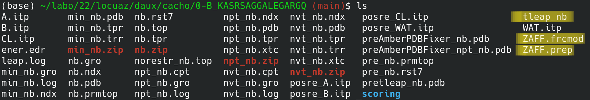

===================================
Tutorial: using Tleap topologies
===================================

While the protocol uses *GROMACS* to perform MD simulation. It can also use **ambertools** to build an amber topology,
which can then be converted into *GROMACS* topology. This allows the use of force fields that are not available in *GROMACS*,
the inclusion of ligands, non-standard amino acids, etc.

In this example, we are going to optimize a nanobody towards a protein that contains Zinc and coordinates it with
amino acids that can't be represented on a regular force-field. Hence, we're going to need ***Tleap*** to build the
topology and **parmed** to turn it into something *GROMACS* can work with. Both these tools come with **ambertools**,
which comes with the protocol. For more info, check the :ref:`installation:Installation` section.

.. figure:: ./resources/tleap_complex.png
        :alt: p53-nanobody complex

        Figure 1: snapshot of one optimized complex. **p53** is the yellow one on the left, with its loops colored red and
        blue, these loops have to be stabilized so it doesn't loose its function; the zinc atom and its coordinating
        residues are on the bottom-left corner. The nanobody is the green one on the right, with its CDRs 1, 2 and 3
        colored magenta, orange and gray, respectively.

As always, the name of our environment is *locuaz*, so we start by activating it.

.. code-block:: console

    mamba activate locuaz

.. warning::
    GROMACS and Amber have different conventions when it comes to *resSeq* numbering. GROMACS goes for a strided
    progression, assigning a *resSeq* number of 1 to the first residue of each chain. Amber, on the other hand,
    expects all residues to have different *resSeq* numbers. *locuaz* supports both conventions, but be aware
    that setting ``use_tleap`` to ``True`` will change the resSeq numbering standard.

Setting up the system
----------------------
The starting complex (**p53-VHH**) in this tutorial has been obtained using `HADDOCK`_, followed by an
equilibration. In this example, the 4-coordinated zinc metal center in **p53** is described with Zinc
AMBER force field **ZAFF**. Therefore, the topology is built with a ***Tleap*** script, which requires
additional parameter files ``ZAFF.frcmod`` and ``ZAFF.prep``.

The topology of the complex provided in this example has been prepared with the following *Tleap* script:

.. code-block:: console

    source oldff/leaprc.ff99SBildn
    source leaprc.water.tip3p
    addAtomTypes { { "ZN" "Zn" "sp3" } { "S2" "S" "sp3" } { "N1" "N" "sp3" } }
    loadamberparams frcmod.ions1lm_126_tip3p
    loadamberprep ZAFF.prep
    loadamberparams ZAFF.frcmod
    mol = loadpdb nb.pdb

    bond mol.195.ZN mol.81.SG
    bond mol.195.ZN mol.84.ND1
    bond mol.195.ZN mol.143.SG
    bond mol.195.ZN mol.147.SG
    bond mol.217.SG mol.292.SG     ##adding the S-S bond

    solvatebox mol TIP3PBOX 10.0
    addions mol CL 0
    addions mol NA 0

    saveamberparm mol amb_nb.prmtop amb_nb.inpcrd
    quit

The script can be run as:

.. code-block:: console

    tleap -f tleap

The topology was then converted into the *GROMACS* topology format using `ParmEd`_, `acpype`_ is
an alternative but we recommend staying with *ParmEd* since it's the same *locuaz* uses internally.

Lastly, the system was minimized and equilibrated using the same *mdp* *GROMACS* input files we will
be using during the protocol, ``min.mdp`` and ``nvt.mdp``. For the *NPT* run, we ran for 10ns and saw
no changes in the interface. Ideally you do not want to start with a complex that changes its interface
too much, since this will change the affinity and the scoring of the mutations loose meaning.

Necessary files
----------------
As in :ref:`tutorialsimple:Tutorial: running a simple optimization`, we're going to focus on the writing
of the YAML config file. A more detailed explanation of the available options, can be found in the
:ref:`configurationfile:YAML configuration file`. The materials for this tutorial are located in
the ``examples/tleap_tutorial`` `folder`_:

1. ``nb.pdb``: the PDB file of the pre-equilibrated complex. As usual, target chains go first, also,
   remember that since we are using *Tleap* residues should be numbered on a continuous progression.
2. ``tleap``: *Tleap* dir with the script to build the topology of the system each time a mutation is performed.
   This script will be identical to the one above, with the exception of the ``solvatebox`` line, since the
   solvent is already there. Another thing to notice is the usage of ``addions``. We keep this commands
   since *Tleap* will be responsible of keeping neutrality of the system and avoid using ``addions2`` since
   we need it to replace water molecules each time it ads ions, to keep the *N* of the system constant.
   ``ZAFF.frcmod`` and ``ZAFF.prep`` (auxiliary Zn parameters)
3. ``config_tleap.yaml``: the input file to run the protocol.
4. ``mdp`` directory: minimization, NVT and NPT *GROMACS* input files.

.. _folder: https://istitutoitalianotecnologia-my.sharepoint.com/personal/walter_rocchia_iit_it/_layouts/15/onedrive.aspx?ga=1&id=%2Fpersonal%2Fwalter%5Frocchia%5Fiit%5Fit%2FDocuments%2FExamples%2Ftleap%5Ftutorial&view=0

The configuration file
-----------------------
We will focus on the new options that didn't show up on :ref:`tutorialsimple:Tutorial: running a simple optimization`.

paths
^^^^^^
.. code-block:: console

    paths:
        gmxrc: /usr/local/gromacs/bin
        scoring_functions: /home/pbarletta/labo/22/locuaz/rebin
        mutator: /home/pbarletta/labo/22/locuaz/rebin/dlpacker
        mdp: /home/pbarletta/labo/22/locuaz/daux/mdp
        input: [ /home/pbarletta/labo/22/locuaz/daux/oct_nb ]
        tleap: /home/pbarletta/labo/22/locuaz/daux/oct_nb/tleap
        work: /home/pbarletta/labo/22/locuaz/daux/work_dir

* *Tleap*: the path to the ***Tleap*** scripts. It is mandatory if *Tleap* is used.

main
^^^^^

The running mode of the protocol is set to evolve, which is the default value, so it's not actually necessary.

.. code-block:: console

    main:
        name: nb
        mode: evolve

protocol
^^^^^^^^
In the protocol section, several important options concerning the protocol have to be specified.

.. code-block:: console

    protocol:
        epochs: 5
        branches: 2
        memory_size: 4
        failed_memory_size: 6
        memory_positions: [[2, 3, 4, 6, 7, 8], [], [], [] ]

* ``memory_positions``: this time we're setting the memory ourselves, at least for the first run. This is used
  to fill a queue of size ``memory_size``. At each epoch, the mutated position will be pushed into the queue
  and thus push out the oldest value. In this config whe are preventing the positions :math:`2, 3, 4, 6, 7`
  and :math:`8` from being mutated, only on the first epoch, since the other 3 slots are occupied by empty
  memories (``[]``). If these empty slots weren't present, then ``[2, 3, 4, 6, 7, 8]`` would last another
  3 epochs.

generation
^^^^^^^^^^^
.. code-block:: console

    generation:
        generator: SPM4i
        probe_radius: 3

This time we are selecting any of the CDR residues in the interface with equal probability.

mutation
^^^^^^^^
.. code-block:: console

    mutation:
        mutator: dlpr
        reconstruct_radius: 5

pruning
^^^^^^^^
.. code-block:: console

    pruning:
        pruner: consensus
        consensus_threshold: 3

md
^^^^
.. code-block:: console

    md:
        gmx_mdrun: gmx mdrun
        mdp_names:
            min_mdp: min.mdp
            nvt_mdp: nvt.mdp
            npt_mdp: npt.mdp
        ngpus: 2
        mpi_procs: 1
        omp_procs: 4
        pinoffsets: [0, 4]
        use_tleap: true
        box_type: octahedron

Notice we're not setting the water model nor the force field, since we're relaying on our *Tleap* script
to take care of that.

* pinoffsets: notice that we are using 4 OMP processors and 2 GPUs, hence, ``pinoffsets`` has a length of 2,
  one for each GPU run, and with a spacing of 4 threads.
* use_tleap: True, this option is specified only if *Tleap* is used to build the topology.

target
^^^^^^^^
.. code-block:: console

    target:
        chainID: [A]

binder
^^^^^^^^
.. code-block:: console

    binder:
        chainID: [B]
        mutating_chainID: [B,B,B]
        mutating_resSeq: [[220,221,222,223,224,225,226,227],[248,249,250,251,252,253,254],[294, 295, 296, 297, 298, 299, 300]]
        mutating_resname: [[S,G,F,D,F,S,D,A],[R,S,G,L,A,T,S],[K,S,R,R,G,Q,G]]

scoring
^^^^^^^^
.. code-block:: console

    scoring:
        functions: [ bluuesbmf, piepisa, evoef2, gmx_mmpbsa ]
        nthreads: 80
        mpiprocs: 2
        start: 50
        end: -1

2 new options show up with respect to the :ref:`tutorialsimple:Tutorial: running a simple optimization`

 * ``start``: Useful if you want to skip a few frames before starting to score. 0-indexed.
 * ``end``: Also 0-indexed. Defaults to ``-1``, which means all remaining frames.

Running the protocol
---------------------
There's nothing new here with respect to the simple tutorial, we just run the protocol with our config file

.. code-block:: console

    mamba activate locuaz
    python /home/user/locuaz/locuaz/protocol.py config_tleap.yaml

And as always, the protocol will create the working directory folder and inside of it, a folder for
each *branch*:

        Figure 2: the look of any *branch* folder after it has been finished. *Tleap* related files
        are highlighted.

.. _HADDOCK: https://wenmr.science.uu.nl/haddock2.4/
.. _ParmEd: https://github.com/ParmEd/ParmEd
.. _acpype: https://github.com/alanwilter/acpype